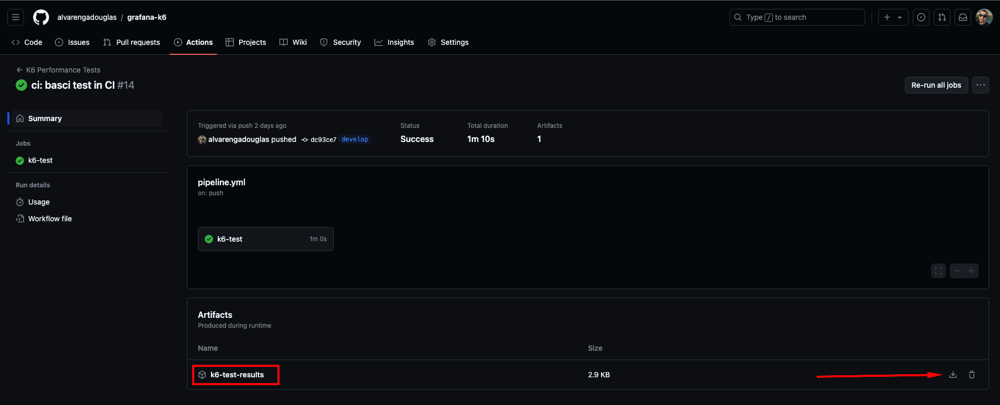

  

O Grafana k6 é uma ferramenta de teste de carga extensível, de código aberto e fácil de usar para desenvolvedores.! 🚀

## Tecnologias 

Esse projeto foi construído com as seguintes tecnologias.

<space><space>
<space><space>

## Sobre o projeto

Esse é um projeto básico de teste de performance integrado a um pipeline de CI do GitHub Actions.

Ao rodar o pipeline você terá as seguintes etapas:
- Instalação do Docker.
- Checkout do código fonte.
- Execução dos testes.
- Extração do relatório.
- Disponibilização do relatório como artefato no GitHub.

## Relatório:
O relatório é disponibilizado após o run da pipeline.

#### Análise relatório - Seção Superior

##### Total Requests: 
Indica o número total de requisições feitas durante o teste.

##### Failed Requests: 
Mostra quantas requisições falharam.

##### Breached Thresholds:
Representa o número de vezes que os thresholds (limites) configurados foram violados. Aqui, não houveram violações.

##### Failed Checks:
Indica o número de "checks" (validações) que falharam. Checks são condições específicas que você pode definir para validar aspectos das respostas.

#### Análise relatório - Request Metrics

Essa seção detalha as métricas de desempenho das requisições HTTP, com os seguintes parâmetros:

| Colunas  | Descrição |
| ------------- | ------------- |
| Average  | Indica que, em média, cada requisição demorou para ser concluída. |
| Maximum  | A requisição mais lenta.  |
| Minimum  | A requisição mais rápida.  |
| Median   | Indica a mediana das requisições concluídas   |
| 90th Percentile  | 90% das requisições foram concluídas dentro do tempo esperado  |
| 95th Percentile  | 95% das requisições foram concluídas dentro do tempo esperado  |

| Métricas de linha:    |
| --------------------  | 
##### http_req_duration:
Tempo total de uma requisição HTTP, desde a conexão até o recebimento completo da resposta.

##### http_req_waiting:
Tempo que a requisição passou esperando pelo servidor, desde o envio até o início da resposta. É um indicador do tempo de processamento do servidor!

##### http_req_connecting:
Mede o tempo gasto na conexão inicial.

##### http_req_tls_handshaking:
Refere-se ao tempo gasto na negociação TLS (conexões HTTPS).

##### http_req_sending:
Mede o tempo gasto enviando dados para o servidor.

##### http_req_receiving:
Refere-se ao tempo gasto para receber dados do servidor após o início da resposta.

##### http_req_blocked:
O tempo que a requisição ficou bloqueada antes de ser processada.

##### iteration_duration:
Refere-se ao tempo total de cada iteração do teste, incluindo a execução do código e a espera entre as requisições.
